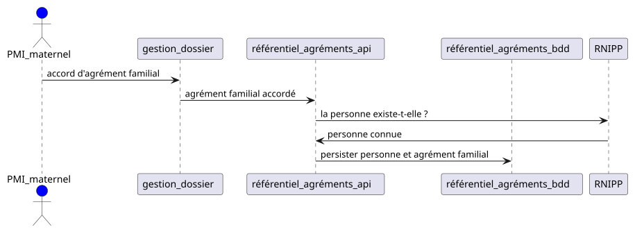
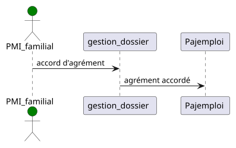
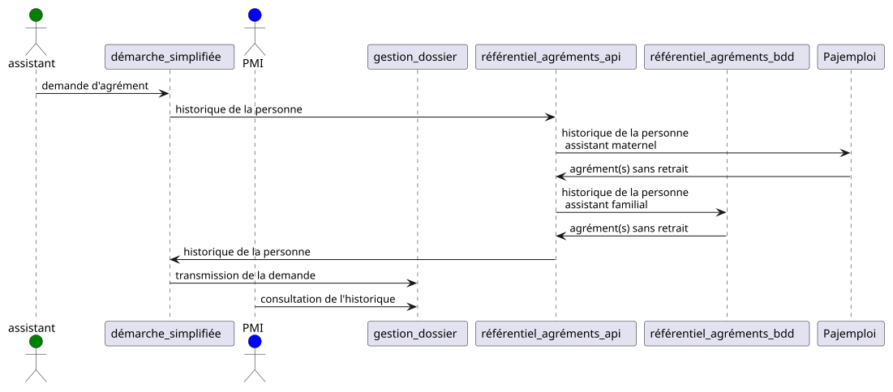

# Référentiel national des agréments d'assistants maternels et familiaux

## Objectifs

Le référentiel national des agréments permettra aux services départementaux de protection maternelle et infantile (PMI) de consulter l'historique des agréments délivrés à un assistant maternel ou familial, afin de ne pas délivrer d'agrément avant un certain délai si le demandeur a fait l'objet d'un retrait d'agrément pour certains motifs.

Le fondement législatif est [la loi n°2022-140 du 7 février 2022](https://www.vie-publique.fr/loi/280364-loi-taquet-7-fevrier-2022-protection-des-enfants-ase), dite loi Taquet, relative à la protection des enfants, en particulier l'article L. 421-7-1 du code de l’action sociale et des familles. Le décret d'application est à paraître prochainement.

[Pour en savoir plus](https://beta.gouv.fr/startups/agrements-assistants-maternels-et-familiaux.html)

## Utilisation

Pour découvrir les routes API, visiter le [Swagger](https://agrements-assistants-maternels-familiaux.osc-fr1.scalingo.io/documentation) de la plateforme de développement.

## Installation

Pour installer l'application en local, suivre [ce guide](INSTALLER.md).

## Architecture

Voilà un aperçu des applications impliquées lors du cycle de vie ([source](documentation)).

### Délivrance d'agrément

Le référentiel des agréments stocke les agréments d'assistants familiaux.

Le référentiel des agréments ne stocke pas les agréments d'assistants maternels.

### Demande d'agrément

Sur la base des agréments précédemment délivrés, on informe le service PMI qui décide de la suite à donner.

Le référentiel consulte :
- pour les agréments d'assistants familiaux : sa base de données ;
- pour les agréments d'assistants maternels : l'API Pajemploi.